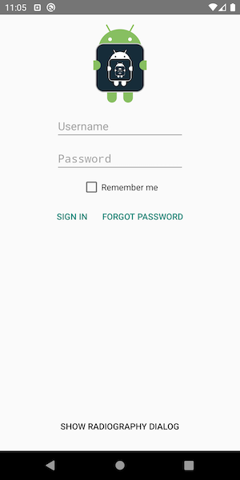
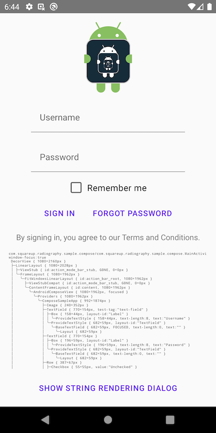

#  Radiography

[](https://search.maven.org/search?q=g:%22com.squareup.radiography%22)
[](https://www.apache.org/licenses/LICENSE-2.0)


Text-ray goggles for your Android UI.

```
DecorView { 1080×2160px }
├─LinearLayout { id:main, 1080×1962px }
│ ├─EditText { id:username, 580×124px, focused, text-length:0, ime-target }
│ ├─EditText { id:password, 580×124px, text-length:0 }
│ ╰─LinearLayout { 635×154px }
│   ├─Button { id:signin, 205×132px, text-length:7 }
│   ╰─Button { id:forgot_password, 430×132px, text-length:15 }
├─View { id:navigationBarBackground, 1080×132px }
╰─View { id:statusBarBackground, 1080×66px }
```

* [Usage](#usage)
* [Result example](#result-example)
* [Jetpack Compose support](#jetpack-compose-support)
* [FAQ](#faq)
* [License](#license)

## Usage

Add the `radiography` dependency to your app's `build.gradle` file:

```gradle
dependencies {
  implementation 'com.squareup.radiography:radiography:2.4.1'
}
```

`Radiography.scan()` returns a pretty string rendering of the view hierarchy of all windows managed by the current process.

```kotlin
// Render the view hierarchy for all windows.
val prettyHierarchy = Radiography.scan()

// Include the text content from TextView instances.
val prettyHierarchy = Radiography.scan(viewStateRenderers = DefaultsIncludingPii)

// Append custom attribute rendering
val prettyHierarchy = Radiography.scan(viewStateRenderers = DefaultsNoPii +
    androidViewStateRendererFor<LinearLayout> {
      append(if (it.orientation == LinearLayout.HORIZONTAL) "horizontal" else "vertical")
    })
```

You can print a subset of the view hierarchies by specifying a `ScanScope`. By default, Radiography
will scan all the windows owned by your app.

```kotlin
// Extension function on View, renders starting from that view.
val prettyHierarchy = someView.scan()

// Render only the view hierarchy from the focused window, if any.
val prettyHierarchy = Radiography.scan(scanScope = FocusedWindowScanScope)

// Filter out views with specific ids.
val prettyHierarchy = Radiography.scan(viewFilter = skipIdsViewFilter(R.id.debug_drawer))

// Combine view filters.
val prettyHierarchy = Radiography.scan(
  viewFilter = skipIdsViewFilter(R.id.debug_drawer) and MyCustomViewFilter()
)
```

## Result example



```
com.squareup.radiography.sample/com.squareup.radiography.sample.MainActivity:
window-focus:false
 DecorView { 1080×2160px }
 ├─LinearLayout { 1080×2028px }
 │ ├─ViewStub { id:action_mode_bar_stub, GONE, 0×0px }
 │ ╰─FrameLayout { id:content, 1080×1962px }
 │   ╰─LinearLayout { id:main, 1080×1962px }
 │     ├─ImageView { id:logo, 1080×352px }
 │     ├─EditText { id:username, 580×124px, text-length:0 }
 │     ├─EditText { id:password, 580×124px, text-length:0 }
 │     ├─CheckBox { id:remember_me, 343×88px, text-length:11 }
 │     ├─LinearLayout { 635×154px }
 │     │ ├─Button { id:signin, 205×132px, text-length:7 }
 │     │ ╰─Button { id:forgot_password, 430×132px, text-length:15 }
 │     ├─View { 1080×812px }
 │     ╰─Button { id:show_dialog, 601×132px, text-length:23 }
 ├─View { id:navigationBarBackground, 1080×132px }
 ╰─View { id:statusBarBackground, 1080×66px }
```

This sample app lives in this repo in the `sample` directory.

## Jetpack Compose support

[Jetpack Compose](https://developer.android.com/jetpack/compose) is Google's new declarative UI
toolkit. It is a completely new implementation, and does not use Android views itself (although it
[interoperates](https://developer.android.com/jetpack/compose/interop#views-in-compose) with them
seamlessly).

Radiography will automatically render composables found in your view tree if the Compose Tooling
library is on the classpath. If you are using Compose, you're probably already using this library
(the `@Preview` annotation lives in the Tooling library). On the other hand, if you're not using
Compose, Radiography won't bloat your app with transitive dependencies on any Compose artifacts.

Compose changes frequently, and while in beta, is being released every two weeks. If you are using
Radiography with an unsupported version of Compose, or you don't depend on the Tooling library, then
Radiography will still try to detect compositions, but instead of rendering the actual hierarchy, it
will just include a message asking you to upgrade Radiography or add the Tooling library.

### Compose usage

The only thing required for Radiography to render composables is to include the tooling library as
a dependency:
```kotlin
dependencies {
  implementation("androidx.compose.ui:ui-tooling:1.0.0-betaXY")
}
```

When the tooling library is present, Radiography will automatically render composables. However,
Radiography's Compose support is experimental. To use any of the compose-specific APIs, you will
need to opt-in using the `@OptIn(ExperimentalRadiographyComposeApi::class)` annotation.

### Rendering composables

The `DefaultsNoPii` and `DefaultsIncludingPii` renderers include default Compose renderers – you
don't need to do anything special. Additional Compose-specific renderers can be found in the
`ComposableRenderers` object.

To create a custom renderer for Compose, implement a `ViewStateRenderer` to handle values of type
`ComposeView`. However, since Radiography gets most of its information about composables from their
semantics properties, in most cases you shouldn't need to define any custom rendering logic. 
`ComposeView` has a list of all the `Modifier`s that have been applied to the composable, including
its [semantics](https://developer.android.com/reference/kotlin/androidx/compose/ui/semantics/SemanticsModifier?hl=en#semanticsConfiguration:androidx.compose.ui.semantics.SemanticsConfiguration).

```kotlin
// Custom modifier that tells its parent if it's a favorite child or not.
data class IsFavoriteChildModifier(val isFavorite: Boolean) : ParentDataModifier {
  override fun Density.modifyParentData(parentData: Any?): Any? = this@IsFavoriteChildModifier
}

// Renderer for the above modifier.
@OptIn(ExperimentalRadiographyComposeApi::class)
val IsFavoriteChildRenderer = ViewStateRenderer { view ->
  val modifier = (view as? ComposeView)
      ?.modifiers
      ?.filterIsInstance<IsFavoriteChildModifier>()
      ?.singleOrNull()
      ?: return@ViewStateRenderer
  append(if (modifier.isFavorite) "FAVORITE" else "NOT FAVORITE")
}
```

### Selecting which composables to render

Radiography lets you start scanning from a particular view by using the `singleViewScope`
`ScanScope` or the `View.scan()` extension function. Compose doesn't have the concept a "view" as
something that can be stored in a variable and passed around, but you can explicitly tag composables
with strings using the [`testTag`](https://developer.android.com/reference/kotlin/androidx/compose/ui/platform/package-summary#(androidx.compose.ui.Modifier).testTag(kotlin.String))
modifier, and then tell Radiography to only scan certain tags by passing a `composeTestTagScope`.

For example, say you have an app with some navigation controls at the top and bottom of the screen,
but you only want to scan the main body of the screen in between them:
```kotlin
@Composable fun App() {
  Column {
    ActionBar()
    Body(Modifier.testTag("app-body"))
    BottomBar()
  }
}
```

To start scanning from `Body`:
```kotlin
@OptIn(ExperimentalRadiographyComposeApi::class)
val prettyHierarchy = Radiography.scan(scanScope = composeTestTagScope("app-body"))
```

You can also filter composables out using test tags. For example, say you have a screen that has a
debug drawer:
```kotlin
@Composable fun App() {
  ModalDrawerLayout(drawerContent = {
    DebugDrawer(Modifier.testTag("debug-drawer"))
  }) {
    Scaffold(…) {
      …
    }
  }
}
```

To exclude the debug drawer and its children from the output, use `skipComposeTestTagsFilter`:
```kotlin
@OptIn(ExperimentalRadiographyComposeApi::class)
val prettyHierarchy = Radiography.scan(viewFilter = skipComposeTestTagsFilter("debug-drawer"))
```

To write a custom filter for Compose, implement a `ViewFilter` to handle values of type
`ComposeView`. For example, a filter that excludes composables with a particular `Modifier.layoutId`
might look something like this:
```kotlin
fun skipLayoutIdsFilter(skipLayoutId: (Any) -> Boolean) = ViewFilter { view ->
  (view as? ComposeView)
      ?.modifiers
      ?.asSequence()
      ?.filterIsInstance<LayoutIdParentData>()
      ?.none { layoutId -> skipLayoutId(layoutId.id) }
      // Include all views and composables that don't have any layoutId.
      ?: true
}
```

### Subcomposition scanning

In Compose, the term "composition" is often used to refer to a single tree of composables that all
share some core state (e.g. ambients) and use the same underlying slot table. A subcomposition is a
distinct composition that has a reference to a particular point in another composition (its parent).
Subcompositions share the parent's ambients, but can be created at any time and disposed
independently of the parent composition.

Subcomposition is used for a number of things:

1. Compose children which have a data dependency on a property of the parent composition that is
   only available after the composition pass, e.g. `WithConstraints` (which can only compose its
   children during layout).
2. Lazy composition, where the "current" actual children of a composable depend on some runtime
   state, and old/uncreated children should be not be composed when not needed, to save resources.
   `LazyColumn` does this.
3. Linking compositions that need to be hosted in entirely separate windows together. `Dialog` uses
   this to make the dialog children act as children of the composable that invokes them, even though
   they're hosted in a separate window, with a Android view host.

Rendering subcomposition is tricky, because there's no explicit reference from the parent
`CompositionReference` to where the subcompositions' composables actually appear. Fortunately,
`SubcomposeLayout` is a helper composable which provides a convenient wrapper around subcomposition
for common use cases such as 1 and 2 above – basically any time the subcomposition is actually a
visual child of the parent composable, but can only be created during the layout pass.
`SubcomposeLayout` shows up as a pattern in the slot tables' groups which Radiography detects and
renders in a way that makes the subcomposition look like regular children of the parent composable.

Non-`SubcomposeLayout` subcompositions, like the one from `Dialog`, are rendered a bit more
awkwardly. The subcomposition is shown as a child of the parent layout node. In the case of
`Dialog`, this is fine, since there's no actual layout node in the parent composition which acts as
a parent for the subcomposition. More complex use cases may be rendered differently, e.g. if there's
a layout node which "hosts" the subcomposition, it will appear after the actual
`CompositionReference` in the slot table, and thus the subcomposition and its subtree will appear
before the layout node in the rendering.

Subcompositions have their own slot table that is not shared with their parent. For this reason,
Radiography needs to do some extra work to scan subcompositions, since they won't be processed
simply by reading the parent's slot table. Subcompositions are detected by looking for instances of
[`CompositionReference`](https://developer.android.com/reference/kotlin/androidx/compose/runtime/CompositionReference)
in the parent slot table. `CompositionReference` is an abstract class, but the only concrete
implementation currently in Compose contains references to all actual compositions that use it as a
parent. Reflection is used to pull the actual subcompositions out of the parent reference, and then
those compositions' slot tables are analyzed in turn, and its root composables are rendered as
childrens of the node that owns the `CompositionReference`.

### Compose example output



```
com.squareup.radiography.sample.compose/com.squareup.radiography.sample.compose.MainActivity:
window-focus:false
 DecorView { 1080×2160px }
 ├─LinearLayout { 1080×2028px }
 │ ├─ViewStub { id:action_mode_bar_stub, GONE, 0×0px }
 │ ╰─FrameLayout { 1080×1962px }
 │   ╰─FitWindowsLinearLayout { id:action_bar_root, 1080×1962px }
 │     ├─ViewStubCompat { id:action_mode_bar_stub, GONE, 0×0px }
 │     ╰─ContentFrameLayout { id:content, 1080×1962px }
 │       ╰─AndroidComposeView { 1080×1962px, focused }
 │         ╰─Providers { 1080×1962px }
 │           ╰─ComposeSampleApp { 992×1874px }
 │             ├─Image { 240×352px }
 │             ├─TextField { 770×154px, test-tag:"text-field" }
 │             │ ├─Box { 200×59px, layout-id:"Label" }
 │             │ │ ╰─ProvideTextStyle { 200×59px, text-length:8 }
 │             │ ╰─ProvideTextStyle { 682×59px, layout-id:"TextField" }
 │             │   ╰─BaseTextField { 682×59px, text-length:0 }
 │             │     ╰─Layout { 682×59px }
 │             ├─TextField { 770×154px }
 │             │ ├─Box { 196×59px, layout-id:"Label" }
 │             │ │ ╰─ProvideTextStyle { 196×59px, text-length:8 }
 │             │ ╰─ProvideTextStyle { 682×59px, layout-id:"TextField" }
 │             │   ╰─BaseTextField { 682×59px, text-length:0 }
 │             │     ╰─Layout { 682×59px }
 │             ├─Row { 387×67px }
 │             │ ├─Checkbox { 55×55px, value:"Unchecked" }
 │             │ ├─Spacer { 22×0px }
 │             │ ╰─Text { 298×59px, text-length:11 }
 │             ├─Row { 685×99px }
 │             │ ├─TextButton { 199×99px }
 │             │ │ ╰─Providers { 155×55px }
 │             │ │   ╰─Text { 155×52px, text-length:7 }
 │             │ ╰─TextButton { 442×99px }
 │             │   ╰─Providers { 398×55px }
 │             │     ╰─Text { 398×52px, text-length:15 }
 │             ├─AndroidView {  }
 │             │ ╰─ViewBlockHolder { 919×53px }
 │             │   ╰─TextView { 919×53px, text-length:53 }
 │             ├─ScrollableRow { 1324×588px }
 │             │ ╰─ScrollableColumn { 1324×1026px }
 │             │   ╰─Text { 1324×1026px, test-tag:"live-hierarchy", text-length:2525 }
 │             ╰─TextButton { 737×99px }
 │               ╰─Providers { 693×55px }
 │                 ╰─Text { 693×52px, text-length:28 }
 ├─View { id:navigationBarBackground, 1080×132px }
 ╰─View { id:statusBarBackground, 1080×66px }
```

This sample can be found in the `sample-compose` directory.

## FAQ

### What is Radiography useful for?

Radiography is useful whenever you want to look at the view hierarchy and don't have the ability to connect the hierarchy viewer tool. You can add the view hierarchy string as metadata to crash reports, add a debug drawer button that will print it to Logcat, and use it to improve Espresso errors ([here's an example](https://twitter.com/Piwai/status/1291771701584252928)).

### Is Radiography production ready?

The code that retrieves the root views is based on Espresso's [RootsOracle](https://github.com/android/android-test/blob/master/espresso/core/java/androidx/test/espresso/base/RootsOracle.java) so it's unlikely to break in newer Android versions. We've been using Radiography for crash reports in production since 2015 without any issue.

### Why use custom attribute string rendering instead of View.toString() ?

The output of `View.toString()` is useful but harder to read:

```
// View.toString():
Button { VFED..C.. ........ 0,135-652,261 #7f010001 app:id/show_dialog }
// Radiography:
Button { id:show_dialog, 652x126px, text-length:28 }
```

If you'd rather rely on `View.toString()`, you can provide a custom state renderer.

```kotlin
val prettyHierarchy = Radiography.scan(viewStateRenderers = listOf(androidViewStateRendererFor<View> {
  append(
      it.toString()
          .substringAfter(' ')
          .substringBeforeLast('}')
  )
}))
```

### How are compositions rendered?

_Disclaimer: Compose is changing frequently, so many of these details may change without warning,
and none of this is required to use Radiography!_

The API for configuring how composables are rendered is slightly different than for regular views,
since composables simply _are not_ `View`s. What might define a UI "component" or "widget" logically
isn't made up of any single, nicely-encapsulated object. It is likely a few layers of convenience
`@Composable` functions, with some `Modifier`s applied at various levels, and state is stored in
the slot table via `remember{}`, not in instance fields.

Radiography uses the Compose Tooling library to parse a composition's slot table into a tree of
objects which represent "groups" – each group can represent some data stored in the slot table,
a function call, or an emitted layout node or Android view. Groups may include source locations in
certain cases, and contain information about modifiers and function parameters. This is a really
powerful API, but there's a _lot_ of data there, and much of it is not helpful for a description
that should be easy to read to get a general sense of the state of your UI.

Radiography filters this detailed tree of groups down to only contain the actual `LayoutNode`s and
Android `View`s emitted by the composition. It identifies each such node by the name of the function
call that is highest in the subtree below the parent emitted node. The node's modifiers are used to
extract interesting data about the composable. Most of the interesting data is stored in a single
modifier, the `SemanticsModifier`. This is the modifier used to store "semantics" information which
includes accessibility descriptions, actions, and flags, and is also used for writing UI tests.

## License

<pre>
Copyright 2020 Square Inc.

Licensed under the Apache License, Version 2.0 (the "License");
you may not use this file except in compliance with the License.
You may obtain a copy of the License at

    http://www.apache.org/licenses/LICENSE-2.0

Unless required by applicable law or agreed to in writing, software
distributed under the License is distributed on an "AS IS" BASIS,
WITHOUT WARRANTIES OR CONDITIONS OF ANY KIND, either express or implied.
See the License for the specific language governing permissions and
limitations under the License.
</pre>
