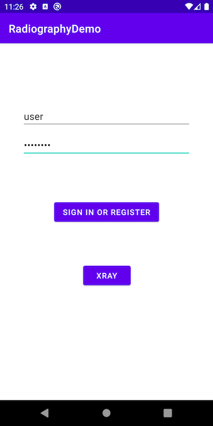

# Radiography


[](https://search.maven.org/search?q=g:%22com.squareup.radiography%22)
[](https://www.apache.org/licenses/LICENSE-2.0)


Radiography provides a utility class to pretty print a view hierarchy.

## Usage

Add the `radiography` dependency to your app's build.gradle file:

```gradle
dependencies {
  implementation 'com.squareup.radiography:radiography:2.0.0'
}
```

`Radiography.scan()` returns a pretty string rendering of the view hierarchy of all windows managed by the current process.

```kotlin
// Render the view hierarchy for all windows.
val prettyHierarchy = Radiography.scan()

// Include the text content from TextView instances.
val prettyHierarchy = Radiography.scan(stateRenderers = defaultsIncludingPii)

// Append custom attribute rendering
val prettyHierarchy = Radiography.scan(stateRenderers = defaultsNoPii +
    stateRendererFor<LinearLayout> {
      append(if (it.orientation == LinearLayout.HORIZONTAL) "horizontal" else "vertical")
    })
```

You can print a subset of the view hierarchies.

```kotlin
// Extension function on View, renders starting from that view.
val prettyHierarchy = someView.scan()

// Render only the view hierarchy from the focused window, if any.
val prettyHierarchy = Radiography.scan(viewFilter = FocusedWindowViewFilter)

// Filter out views with specific ids.
Radiography.scan(viewFilter = SkipIdsViewFilter(R.id.debug_drawer))

// Combine view filters.
Radiography.scan(viewFilter = FocusedWindowViewFilter and MyCustomViewFilter())
```

## Result example



```
com.squareup.radiography.sample/com.squareup.radiography.sample.MainActivity:
window-focus:true
     DecorView { 1080x2160px }
     +-LinearLayout { 1080x2028px }
     | +-ViewStub { id:action_mode_bar_stub, GONE, 0x0px }
     | `-FrameLayout { 1080x1962px }
     |   `-ActionBarOverlayLayout { id:decor_content_parent, 1080x1962px }
     |     +-ContentFrameLayout { id:content, 1080x1808px }
     |     | `-ConstraintLayout { id:container, 1080x1808px }
     |     |   +-AppCompatEditText { id:username, 860x124px, text-length:4 }
     |     |   +-AppCompatEditText { id:password, 860x124px, focused, text-length:8, ime-target }
     |     |   +-MaterialButton { id:login, 533x132px, text-length:19 }
     |     |   +-MaterialButton { id:xray, 242x132px, text-length:4 }
     |     |   `-ProgressBar { id:loading, GONE, 0x0px }
     |     `-ActionBarContainer { id:action_bar_container, 1080x154px }
     |       +-Toolbar { id:action_bar, 1080x154px }
     |       | +-AppCompatTextView { 468x74px, text-length:15 }
     |       | `-ActionMenuView { 0x154px }
     |       `-ActionBarContextView { id:action_context_bar, GONE, 0x0px }
     +-View { id:navigationBarBackground, 1080x132px }
     `-View { id:statusBarBackground, 1080x66px }
```

## License


<pre>
Copyright 2020 Square Inc.

Licensed under the Apache License, Version 2.0 (the "License");
you may not use this file except in compliance with the License.
You may obtain a copy of the License at

    http://www.apache.org/licenses/LICENSE-2.0

Unless required by applicable law or agreed to in writing, software
distributed under the License is distributed on an "AS IS" BASIS,
WITHOUT WARRANTIES OR CONDITIONS OF ANY KIND, either express or implied.
See the License for the specific language governing permissions and
limitations under the License.
</pre>

